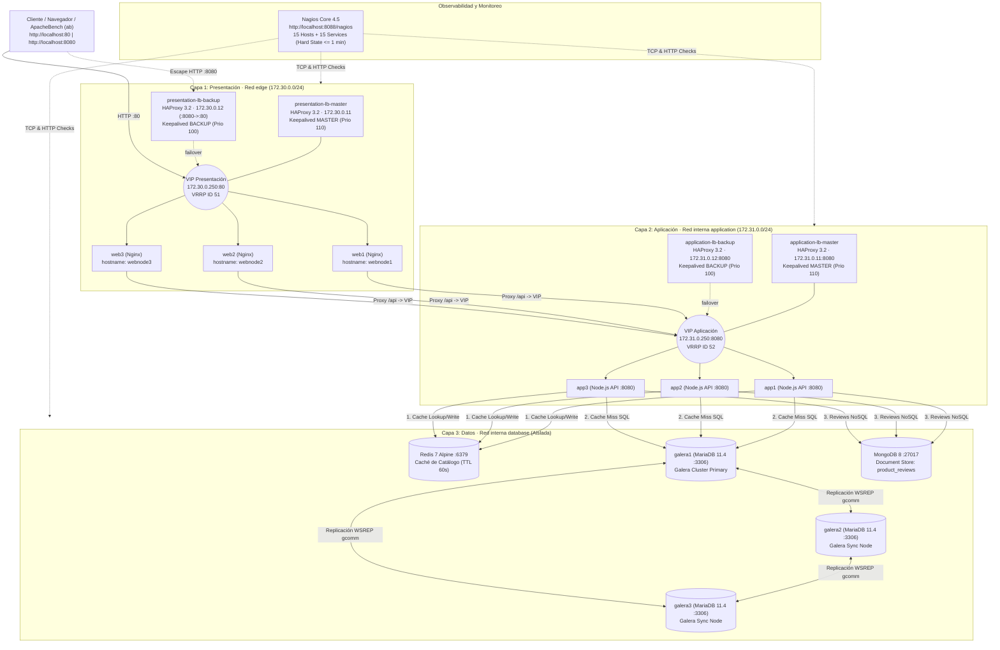

# Diagrama de Arquitectura — Tarea #995

## Código Mermaid

```mermaid
flowchart TB
    Browser["Cliente / Navegador / ApacheBench (ab)<br/>http://localhost:80 | http://localhost:8080"]

    subgraph Edge["Capa 1: Presentación · Red edge (172.30.0.0/24)"]
        PLBM["presentation-lb-master<br/>HAProxy 3.2 · 172.30.0.11<br/>Keepalived MASTER (Prio 110)"]
        PVIP(("VIP Presentación<br/>172.30.0.250:80<br/>VRRP ID 51"))
        PLBB["presentation-lb-backup<br/>HAProxy 3.2 · 172.30.0.12 (:8080->:80)<br/>Keepalived BACKUP (Prio 100)"]
        W1["web1 (Nginx)<br/>hostname: webnode1"]
        W2["web2 (Nginx)<br/>hostname: webnode2"]
        W3["web3 (Nginx)<br/>hostname: webnode3"]

        PLBM --- PVIP
        PLBB -. failover .-> PVIP
        PVIP --> W1 & W2 & W3
    end

    subgraph App["Capa 2: Aplicación · Red interna application (172.31.0.0/24)"]
        ALBM["application-lb-master<br/>HAProxy 3.2 · 172.31.0.11:8080<br/>Keepalived MASTER (Prio 110)"]
        AVIP(("VIP Aplicación<br/>172.31.0.250:8080<br/>VRRP ID 52"))
        ALBB["application-lb-backup<br/>HAProxy 3.2 · 172.31.0.12:8080<br/>Keepalived BACKUP (Prio 100)"]
        A1["app1 (Node.js API :8080)"]
        A2["app2 (Node.js API :8080)"]
        A3["app3 (Node.js API :8080)"]

        ALBM --- AVIP
        ALBB -. failover .-> AVIP
        AVIP --> A1 & A2 & A3
    end

    subgraph Data["Capa 3: Datos · Red interna database (Aislada)"]
        R[("Redis 7 Alpine :6379<br/>Caché de Catálogo (TTL 60s)")]
        G1[("galera1 (MariaDB 11.4 :3306)<br/>Galera Cluster Primary")]
        G2[("galera2 (MariaDB 11.4 :3306)<br/>Galera Sync Node")]
        G3[("galera3 (MariaDB 11.4 :3306)<br/>Galera Sync Node")]
        M[("MongoDB 8 :27017<br/>Document Store: product_reviews")]

        G1 <-->|"Replicación WSREP gcomm"| G2
        G2 <-->|"Replicación WSREP gcomm"| G3
        G3 <-->|"Replicación WSREP gcomm"| G1
    end

    subgraph Mon["Observabilidad y Monitoreo"]
        N["Nagios Core 4.5<br/>http://localhost:8088/nagios<br/>15 Hosts + 15 Services (Hard State <= 1 min)"]
    end

    Browser -->|"HTTP :80"| PVIP
    Browser -.->|"Escape HTTP :8080"| PLBB
    W1 & W2 & W3 -->|"Proxy /api -> VIP"| AVIP
    A1 & A2 & A3 -->|"1. Cache Lookup/Write"| R
    A1 & A2 & A3 -->|"2. Cache Miss SQL"| G1
    A1 & A2 & A3 -->|"3. Reviews NoSQL"| M
    N -.->|"TCP & HTTP Checks"| Edge & App & Data
```

